<!-- All visuals are self-generated SVGs — see scripts/readme/ (bun run readme:assets). -->
<!-- Stats refresh daily via .github/workflows/readme-assets.yml -->


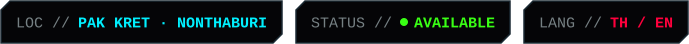

<!-- 00 // IDENTITY -->

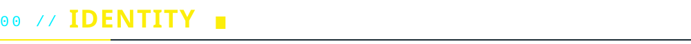

**Forward-thinking Software Developer specializing in modern JavaScript/TypeScript
ecosystems and high-performance system design.**

⚡ This repo is the source of my Cyberpunk-2077-themed portfolio → **[nooobtimex.me](https://nooobtimex.me)**

 

<!-- 01 // CAREER_TRACE -->

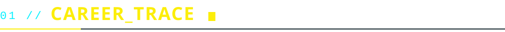

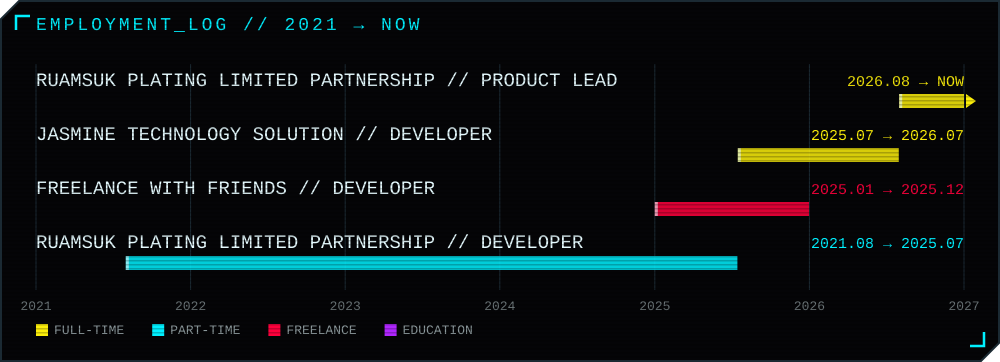

<!-- 02 // GIGS -->

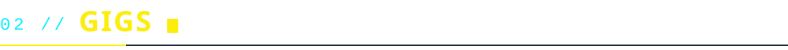

[](https://nooobtimex.me/projects/monomax-epl-portal)
[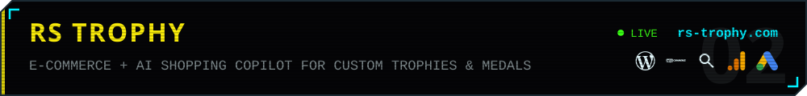](https://rs-trophy.com)
[](https://looklook.pet)
[](https://prettier-config.dev)
[](https://nooobtimex.me)

<!-- 03 // ARSENAL -->

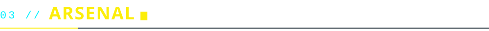

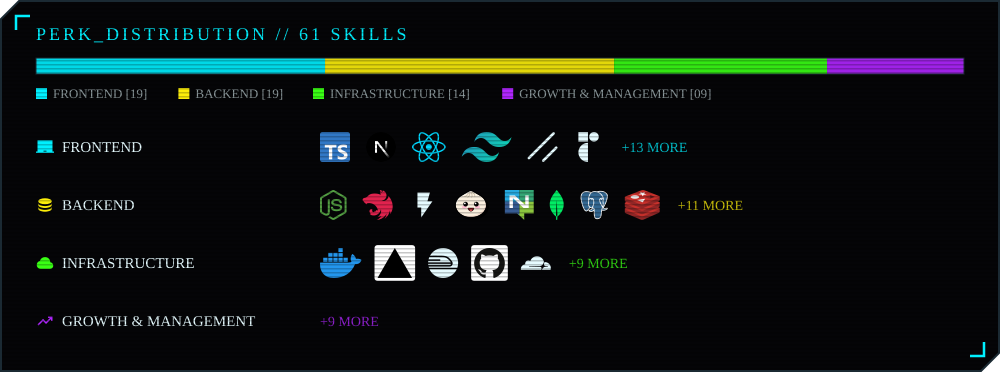

<!-- 04 // GITHUB_FEED -->

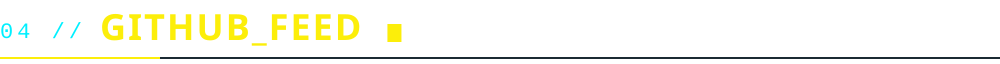

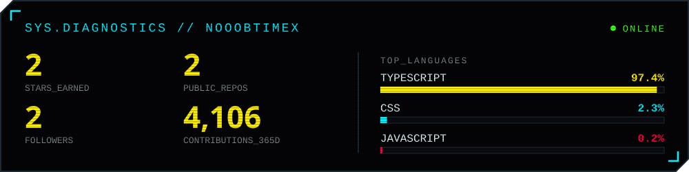

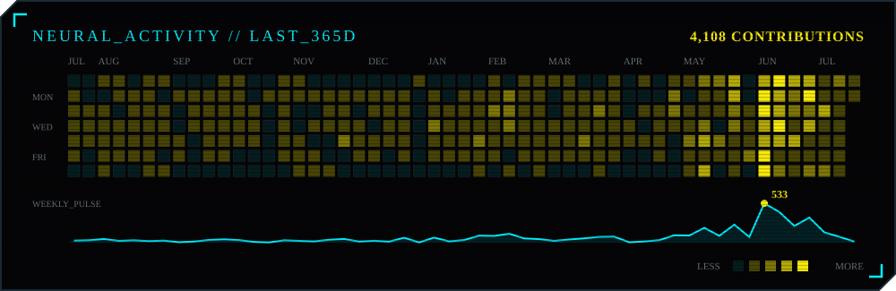

<!-- 05 // COMMS -->

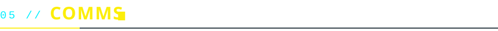

 
 

<code>// EOF — WAKE UP, SAMURAI. THERE'S CODE TO WRITE.</code>

